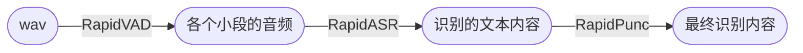

## RapidVAD

    
    <a href="">=3.7,<=3.10-aff.svg"></a>

## TODO
- python版RapidVAD

#### 📖文档导航
- [Python](./python/README.md)

#### 🎨整体框架

```mermaid
flowchart LR

A([wav]) --RapidVAD--> B([各个小段的音频]) --RapidASR--> C([识别的文本内容]) --RapidPunc--> D([最终识别内容])
```

#### 📣更新日志

详情

- 2023-05-08 update:
    - Init

